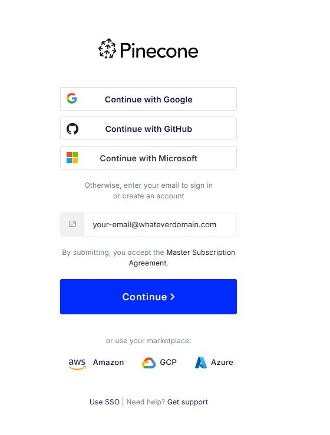
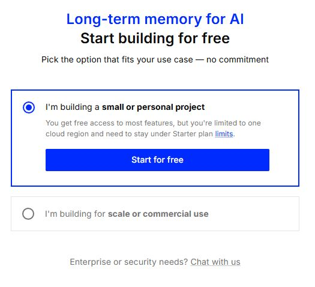
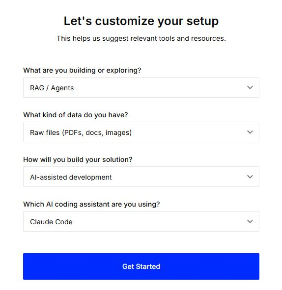
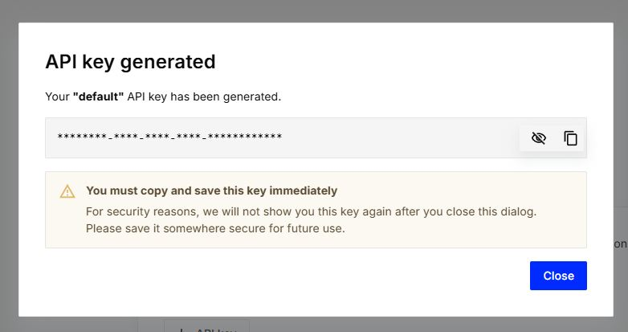

# Obtaining a Pinecone API Key

The Pinecone Assistant MCP Server requires one API key to function:

- **Pinecone API Key**: Required — used for all assistant operations

Follow these steps to obtain your API key:

---

## Pinecone API Key

### Step 1: Create a Pinecone Account

1. Visit: https://app.pinecone.io/?sessionType=signup
2. Sign up using one of these methods:

   **Option A:** Link to your existing Google, GitHub or Microsoft account

   **OR**

   **Option B:** Enter an email address:
   
   - Fill out the registration form
   - Receive verification email
   - Type in the code from the e-mail to confirm your account



​       Select the option that is for your use case.  



​      Finish the Questions and Select "Get Started"



---

### Step 2: Record your default API Key

3. After logging in, your initial "default" API Key will be generated
4. Use the Copy Button or the Show button on the key to copy to the clipboard or show the API key

   - Copy the API key immediately — **it is only displayed once**
5. The key format is: `pcsk_XXXXXXXXXXXXXXXXXXXXXXXXXXXX`

   - **Important**: Treat this key like a password
   - Anyone with this key can access your Pinecone resources and incur charges



---

### Step 3: Secure Storage

12. Store the key in a secure location before closing the dialog

13. When running the deployment script, paste the API key when prompted:
    ```
    Enter your Pinecone API key (pcsk_...):
    ```
    The script will store it using **Windows DPAPI encryption**.

---

## Plan Selection

Before or after generating your API key, review the plan options:

### Starter Plan (Free)
- **Lifetime limits per project** (not monthly):
  - 500K context tokens total
  - 1.5M input tokens total
  - 200K output tokens total
- 1 project, up to 5 assistants, up to 10 files per assistant
- Suitable for evaluation of this MCP and the included USPTO documents and limited testing

### Standard Plan ($50/month minimum)
- Hourly assistant charge: $0.05/hour (regardless of activity)
- Input tokens: $8/million, Output tokens: $15/million, Context tokens: $5/million
- Storage: $3/GB per month
- Suitable for regular use and production workflows

### Enterprise Plan ($500/month minimum)
- Custom pricing and SLA agreements
- Suitable for high-volume production environments

> **Recommendation**: Start with the Starter Plan to evaluate the MCP. Upgrade to Standard when you need regular access. See [Pinecone Pricing](https://docs.pinecone.io/guides/assistant/pricing-and-limits) for current details.

---

## After Installation: Key Management

If you need to update your API key after initial setup, use the assistant management script:

```powershell
# Manage assistants and configuration
.\deploy\manage_assistant.ps1
```

Or re-run the setup script to reconfigure everything:

```powershell
.\deploy\windows_setup.ps1
```

---

## Troubleshooting

### "Authentication failed" errors
- Verify the key starts with `pcsk_`
- Ensure you copied the complete key (they can be long)
- Check that the key belongs to the correct project
- Try generating a new key if the current one may have been compromised

### Key not accepted by deployment script
- Paste the key directly without extra spaces or line breaks
- If copying from a password manager, paste into Notepad first to verify

### Forgot to copy the key
- Return to the Pinecone Console → API Keys
- Delete the old key and create a new one
- Re-run the deployment script with the new key

---

## Summary

✅ **Pinecone API Key**: Required, starts with `pcsk_`, stored securely via Windows DPAPI

The deployment script handles all secure storage automatically. You never need to manually edit configuration files or store the key in plain text.

For security best practices, see [SECURITY_GUIDELINES.md](./SECURITY_GUIDELINES.md).
