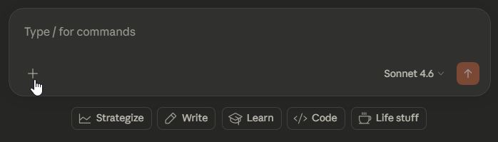
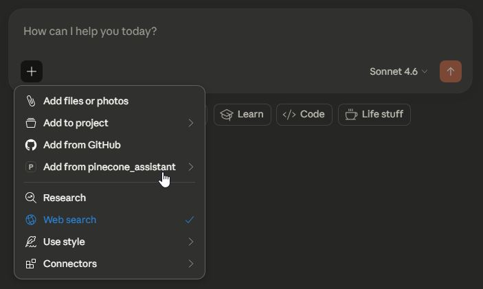
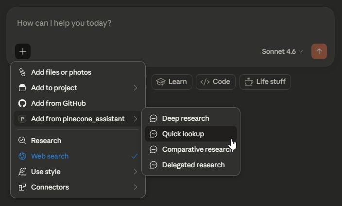
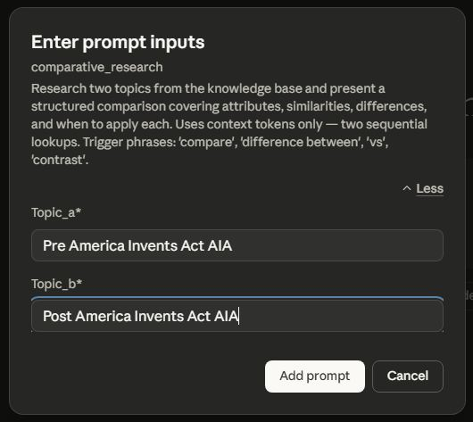
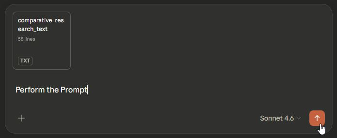

# Pinecone Assistant MCP - Prompt Templates

This document details the prompt templates included with the Pinecone Assistant MCP Server for guided document research workflows.

## ⚡ Prompt Templates (Corpus-Neutral Research Workflows)

**The Pinecone Assistant MCP includes 4 prompt templates** that appear in the Claude Desktop UI. These templates provide structured research workflows optimized for token efficiency and eliminate the need to manually construct tool calls.

### 🎯 **How to Use Prompt Templates**

1. **In Claude Desktop**: Press the `+` button

   

2. **Select "Add from pinecone_assistant"** from the dropdown menu

   

3. **Select the desired Prompt** from the dropdown menu

   

4. **Fill in the parameters** — read the guidance for which fields are required

   

5. **Execute  - (Recommendation: Type in "Perform the Prompt" before hitting Execute)** — Claude will automatically run the complete workflow

   

---

## Overview

All four prompts are **corpus-neutral** — they work with any document domain (legal, medical, technical, financial). They are pre-configured to use context-only tools by default, minimizing token costs on free-tier plans.

### Token Tiers

| Tier | Tools Used | Token Pool | Cost Impact |
|------|-----------|-----------|------------|
| **Context only** | `assistant_context`, `assistant_strategic_multi_search_context` | Context tokens | Lowest cost |
| **Context + LLM** | `assistant_chat` | Context + input/output tokens | Higher cost |

> **Free Tier Note**: Context-only prompts draw from the 500K context token lifetime pool. LLM prompts draw from the 1.5M input / 200K output lifetime pools. See README for full pricing details.

---

## Research Prompts

### `deep_research` — Thorough Multi-Angle Coverage

**Purpose**: Comprehensive research across multiple search angles using strategic multi-search patterns.

**Token Tier**: Context only (no AI synthesis cost)

**Parameters**:

| Parameter | Required | Description |
|-----------|----------|-------------|
| `topic` | **Required** | The research topic or question |
| `domain` | Optional | Strategic search domain from `strategic-searches.yaml` (e.g., `section_101_eligibility` for USPTO corpus) |

**Generated Workflow**:
1. Calls `get_configuration_status` to confirm active assistant and available domains
2. Executes `assistant_strategic_multi_search_context` with the topic and optional domain
3. Returns raw document chunks organized by search pattern for Claude to analyze
4. Claude synthesizes findings from retrieved content

**Best For**:
- Comprehensive topic coverage when you need multiple angles
- Research before drafting responses or analysis documents
- Discovery phase — understanding what documents say before deeper dives

**Example Use**:
```
Topic: "obviousness combination of references"
Domain: section_103_obviousness
```

---

### `quick_lookup` — Fast Single-Fact Retrieval

**Purpose**: Rapid lookup of a specific fact, rule, or concept with a single tool call.

**Token Tier**: Context only (no AI synthesis cost)

**Parameters**:

| Parameter | Required | Description |
|-----------|----------|-------------|
| `topic` | **Required** | The specific topic, rule number, or concept to look up |

**Generated Workflow**:
1. Calls `assistant_context` with `top_k=3, snippet_size=1024` for minimal token usage
2. Returns the most relevant document chunks matching the query
3. Claude presents findings from retrieved content

**Best For**:
- Looking up a specific rule, statute, or procedure
- Verifying a single fact quickly
- When you know exactly what you need and don't need broad coverage
- Conserving context token budget on the free tier

**Example Use**:
```
Topic: "MPEP 2106 Alice framework step 2A prong 1"
```

---

### `comparative_research` — Side-by-Side Comparison

**Purpose**: Retrieve and compare documentation on two related topics simultaneously.

**Token Tier**: Context only (no AI synthesis cost)

**Parameters**:

| Parameter | Required | Description |
|-----------|----------|-------------|
| `topic_a` | **Required** | First topic to research and compare |
| `topic_b` | **Required** | Second topic to research and compare |

**Generated Workflow**:
1. Calls `assistant_context` for `topic_a` (top_k=5)
2. Calls `assistant_context` for `topic_b` (top_k=5)
3. Returns both sets of document chunks
4. Claude analyzes and presents a structured comparison

**Best For**:
- Comparing two legal standards, procedures, or concepts
- Understanding differences between related rules or exceptions
- Due diligence requiring side-by-side analysis
- Comparing how similar concepts are treated in different contexts

**Example Use**:
```
Topic A: "IPR estoppel under 35 USC 315(e)"
Topic B: "PGR estoppel under 35 USC 325(e)"
```

---

### `delegated_research` — AI-Synthesized Answers via Delegation

**Purpose**: Delegate research and synthesis to the Pinecone Assistant's AI, receiving a compact citation-backed answer. Pinecone handles retrieval internally — Claude receives only the synthesized result, preserving Claude's context window.

**Token Tier**: Context + LLM (uses input/output token pools — see free tier warnings)

**Parameters**:

| Parameter | Required | Description |
|-----------|----------|-------------|
| `research_question` | **Required** | The full research question for the Pinecone AI to answer |
| `model` | Optional | AI model to use (default: `gpt-4o`). Options: `gpt-4o`, `gpt-4.1`, `o4-mini`, `claude-3-5-sonnet`, `claude-3-7-sonnet`, `gemini-2.5-pro` |
| `prior_context` | Optional | Compact summary of prior conversation context to include for continuity (avoid full conversation history) |

**Generated Workflow**:
1. Calls `assistant_chat` with the research question
2. Pinecone internally retrieves relevant document chunks and feeds them to the configured LLM
3. Returns a synthesized, citation-backed answer (~500–2000 tokens)
4. Claude presents the answer without re-summarizing

**Best For**:
- Questions requiring AI synthesis across multiple document sections
- When Claude's context window is under pressure (delegation returns compact results)
- Agentic workflows chaining multiple independent research questions
- Paid plan users where token cost is less of a concern

**⚠️ Free Tier Warning**: Each call consumes 30K+ input tokens plus output tokens from lifetime pools. Use `deep_research` or `quick_lookup` for context-only retrieval when possible.

**Example Use**:
```
Research question: "What are the requirements for establishing a nexus between objective indicia of nonobviousness and the claimed invention under MPEP 716?"
Model: gpt-4o
Prior context: (leave empty for independent questions)
```

**Agentic Chaining Pattern** (for multi-part research):
```
# Each delegated_research call is stateless and independent
Call 1: "What does MPEP say about claim construction for MPF claims?"
Call 2: "What are the indefiniteness standards under 35 USC 112(b)?"
Call 3: "How does the examiner apply the broadest reasonable interpretation?"

# Claude synthesizes all three compact answers
```

---

## Prompt Selection Guide

| I want to... | Use This Prompt | Token Cost |
|-------------|----------------|-----------|
| Research a topic thoroughly from multiple angles | `deep_research` | Low |
| Look up a specific rule or fact quickly | `quick_lookup` | Lowest |
| Compare two related concepts side by side | `comparative_research` | Low |
| Get a synthesized AI answer with citations | `delegated_research` | High |

### Decision Flow

```
Do I need AI synthesis?
├── No → Use context-only prompts (deep_research, quick_lookup, comparative_research)
│   ├── Single specific fact → quick_lookup
│   ├── Two topics to compare → comparative_research
│   └── Broad coverage needed → deep_research
│
└── Yes → Use delegated_research
    ├── On free tier? → Consider context-only prompts instead
    └── On paid plan or agentic workflow? → delegated_research is ideal
```

---

## Integration with Claude Skills

The prompt templates work best when combined with the included Claude skills, which provide additional guidance on tool selection and workflow optimization:

| Skill | Best Prompts | Notes |
|-------|-------------|-------|
| `pinecone-assistant` | All prompts | Generic corpus research guidance |
| `pinecone-assistant-uspto` | `deep_research` with USPTO domains | Patent law domain selection and workflows |
| `pinecone-assistant-paid-plan` | `delegated_research` | Delegation patterns and context_options tuning |

See [`skills/README.md`](./skills/README.md) for skill installation and usage.

---

## Cross-MCP Integration

When used with the other USPTO MCP servers, prompts can be chained to build comprehensive research workflows:

**Example: Office Action Response Research**
1. Use `quick_lookup` to find the relevant MPEP section for the rejection type
2. Use `deep_research` with the appropriate domain for comprehensive guidance
3. Switch to `uspto_pfw_mcp` to pull the actual prosecution history
4. Use `delegated_research` to synthesize guidance into a draft response framework

For detailed integration patterns, see [USAGE_EXAMPLES.md](./USAGE_EXAMPLES.md).

---

*For setup and installation guidance, see [README.md](README.md) and [INSTALL.md](INSTALL.md).*

*For API key setup, see [PINECONE_KEY_GUIDE.md](PINECONE_KEY_GUIDE.md).*
